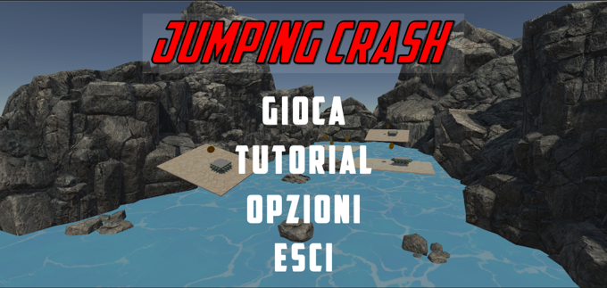
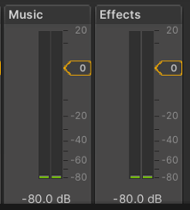

# 🎮 Jumping Crash

A 3D platformer game developed in **Unity (2022.3.8)** using **C# scripts** for gameplay mechanics, UI management, and audio control.  
Inspired by classic platformers like *Super Mario 64*, *Crash Bandicoot*, and *ALTF4*, this project was developed as part of the *Human-Machine Interaction* course at **Politecnico di Bari**.

---

## 🧠 Overview
**Jumping Crash** is a 3D platformer game where the player controls a character named *Crash* through multiple levels filled with traps, moving obstacles, and enemies.  
The main goal is to **collect all coins** and **reach the portal** before the timer expires — combining precision, timing, and awareness.

The project demonstrates advanced use of **Unity Engine** components such as:
- Physics and collision systems  
- Animation controllers  
- Scene management and UI logic  
- Audio Mixer for adaptive sound design  

---

## 🧰 Technologies & Tools
- 
- 
- 
- 

---

## 🕹️ Gameplay Overview

At the start, the player is welcomed by an interactive **Main Menu**, where they can start the game, access the tutorial, or modify audio settings.  
The menu design uses Unity UI components and animated transitions for a smooth experience.

  

The game is composed of **multiple scenes**:
- **Tutorial Scene**: introduces controls and basic movement.  
- **Four main levels**: progressively harder, with moving platforms, traps, and enemies.  
- **End Screen**: shows player score and stars based on completion time.

### 🧭 Controls
- `W`, `A`, `S`, `D` → Move  
- `Space` → Jump  
- `ESC` → Pause Menu  

---

## ⚙️ Level Design

Each level introduces new gameplay elements that challenge the player’s precision and timing:

- **Moving and rotating platforms**
- **Spiked enemies** patrolling certain zones
- **Cannons** shooting projectiles
- **Swinging traps**, **falling logs**, and **wind blades**

  

The environment design balances difficulty with player engagement, ensuring a progressive learning curve and rewarding exploration.

---

## 🔊 Audio Management

The game’s audio system is managed using Unity’s **Audio Mixer**.  
Each scene includes background music and contextual sound effects (jump, collision, coin collection).  
Volume preferences are saved persistently through `PlayerPrefs`, maintaining the user’s audio settings even after closing the game.

  

---

## 🧩 Game Structure

The project is organized as follows:

| Folder | Description |
|---------|-------------|
| **Assets/Audio/** | Contains background music, sound effects, and UI sounds. |
| **Assets/Materials/** | Includes materials and shaders used in the game environment. |
| **Assets/Models/** | 3D models such as the player, enemies, traps, and environmental objects. |
| **Assets/Prefabs/** | Prefabricated reusable objects used throughout multiple scenes. |
| **Assets/Scenes/** | Contains all game scenes: main menu, tutorial, levels, and end screen. |
| **Assets/Scripts/** | C# scripts managing gameplay logic, UI, physics, and audio. |
| **Assets/Textures/** | Textures and visual assets applied to models and materials. |
| **Assets/UI/** | User interface elements such as menus, sliders, and buttons. |

Each folder is structured for modularity, making the project scalable and easy to maintain.

---

## 🧪 Key Features

- Smooth **3D movement** and physics-based collisions  
- Modular **UI system** with menus and sound feedback  
- **Countdown timer** with visual and audio warnings  
- **Particle systems** for explosions, hits, and coins  
- **Level-based progression** with scoring and star ranking  

  

---

## 💡 Technical Highlights

- Developed using **Object-Oriented Programming (OOP)** in C#  
- Modular scripts for player movement, audio, and UI  
- Advanced use of **Unity physics** for moving platforms and objects  
- Persistent game data using **PlayerPrefs**  
- Organized project hierarchy for scalability  

---

## 👥 Authors

Developed by  
**[Tommaso Savino](https://github.com/ItsTomSav)** and **[Francesco Savino](https://github.com/FrankSav80)**  
*Master’s Degree in Automation Engineering* — Politecnico di Bari  

---

## 🎬 Demo

Once uploaded, you can embed a gameplay demo like this:

  

---

## 🧾 License

This project was developed for educational purposes under the *Human-Machine Interaction* course.  
All assets and code are original or used under educational license.

---
